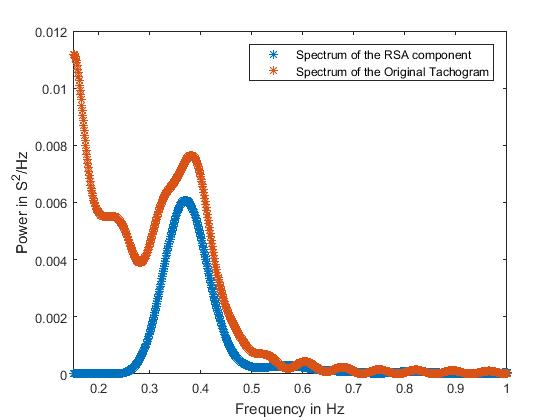

# Any queries/questions/concerns can be sent to: amukher3@rockets.utoledo.edu, abhi0787@gmail.com

# Respiratory-Sinus-Arythmia-estimation(RSA)

The above repo. has the detailed scripts of the methodology adopted and the different evaluation metrics taken into account while estimating the arythmic component from R-R time series.  

Link to the used data-set: https://www.eecs.qmul.ac.uk/mmv/datasets/deap/

We started off with the goal to estimate the arythmic component from the raw BVP/PPG time series datat-sets.The first step was to extract a clean Interbeat interval(IBI)/R-R/Heart Rate(HR) time series from the data-set. It was proceeded by a MA removal algorithm previously adopted described literature. 

Previous research seemed to have taken a "baseline" approach while estimating the arythmic component from HR time series. The most general approach found was to directly filter the frequency component and thereby remove it from the time series. Some of the other approaches taken previously have used the respiratory belt signal as a  reference signal to estimate the RSA component our approach is a standalone method which does not rely on any other derived signal to estimate the respiratory component. 

We decided to take a systemic approach of removing the RSA(Respiratory Sinus Arythmia) from the HR time series. RSA component being heavily affected by our repiration pattern tends to have an increasing effect(increase in tidal volume) during our inspiration and a slow reduction during our expiration. This nature of variation enabled us to form a knowledge-based dictionary which could capture the latent structure in the time series thereby estimating the component. 

# NOTE: The respiratory belt data used here was not of the best quality since the subjects were observing audio-visual clips while being connected with the respiratory belt. Various artifacts(Muscle and Motion) along with some noise seems to be there in the respiratory signal. The literature suggests that respiratory belt data to be ONLY used when the subject is under the effect of sinus breathing NOT under the effect of any external stimuli. 
This might be one of the reasons that the estimate of RSA using the respiratoty belt data as a reference signal in an adaptive filter setting seems to over estimate the spectrum. However, the proposed method seems to estimate the features of the spectrum correctly. 

# CAUTION: Comparing time domain reconstruction of the RSA with the respiratory belt data might seem to be an attractive metric but this idea is fallacious. The respiratory belt data is representative of the arythmic component ONLY when the subject is under the effect of sinus breathing(kind of a relaxed state) having definitive number of annotated breaths in some interval. Comparing the Frequency domain representation of the two signals has been adapted as a standard metric by the community. In addition the respiratory belt data-sets are generally overwhelmed by artifacts and noise which cause additional difficulty in comparison. 

The process and the experimental results with previously used metrics has been detailed in the technical report:
Link to the repo: https://github.com/amukher3/Respiratory-Sinus-Arythmia-estimation 

#For MA removal: https://www.researchgate.net/publication/317290211_Motion_Artifact_Reduction_from_PPG_Signals_During_Intense_Exercise_Using_Filtered_X-LMS
